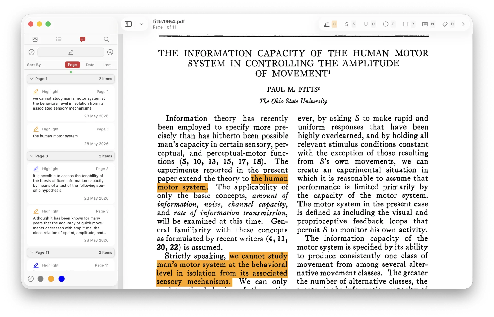
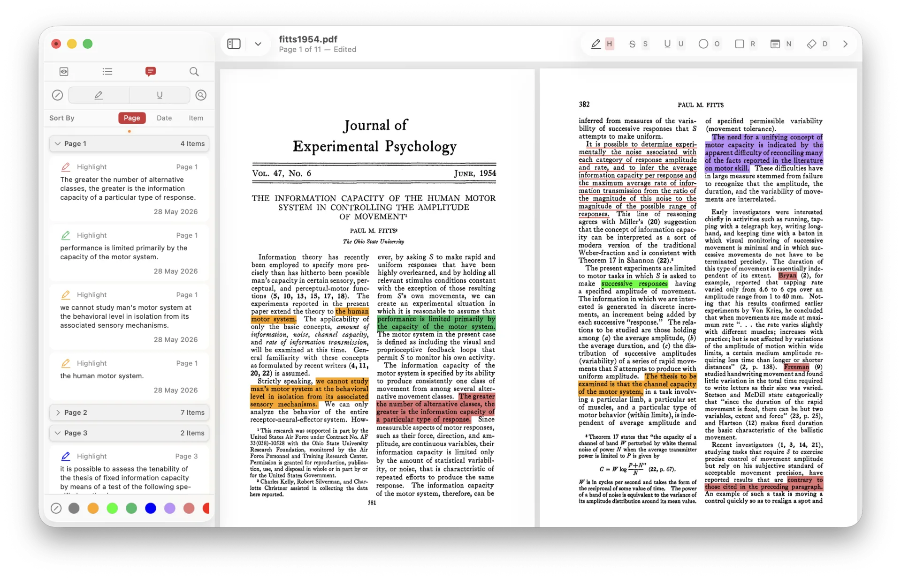
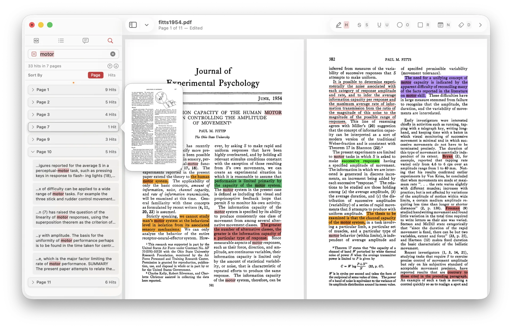

# Angora

> A native macOS PDF reader and annotator for researchers, scholars and professionals.

**[Download the Beta](https://github.com/j-nivekk/Angora-Beta/releases)** · **[angora-app website](https://j-nivekk.github.io/Angora-Beta/)**

---

## Why Angora?

Most PDF readers treat annotation as an afterthought. Highlighting a sentence means moving your cursor to a toolbar, clicking a tool, dragging across the text, and finding your way back to where you were reading. Every round trip is a small context switch. By the end of a long document, those small interruptions add up.

Angora is built on a simpler observation: **the less your cursor leaves the page, the more you stay inside the text.** Press a single key to activate a tool, select your text, and you are done. The cursor never leaves the page, the toolbar never gets in the way, and the document stays at the centre of attention.

This is not a stripped-down reader. It is a full annotation workspace that gets out of your way.

---

## Built natively for the Mac

Angora is written in SwiftUI on top of Apple's PDFKit. Not Electron, not a wrapped web view.

In practice that means:

- **Instant startup.** The app opens and your document appears immediately.
- **Smooth scrolling and zooming.** PDF rendering runs at the system level.
- **Native text selection, copy and search** — the same engine that Preview uses.
- **Low memory footprint.** Angora doesn't load a browser to read a document.
- **System integration.** Undo and redo, standard keyboard shortcuts, multi-window support, and macOS appearance settings all work the way you expect.

The interface follows macOS design conventions — if you're comfortable with Preview or Finder, there is no new design language to learn. On macOS 26 (Tahoe) and later, Angora adopts the new translucent glass effect for its toolbar and overlay elements.

---

## One-key annotation

Press a letter to activate a tool, select your text, and you are done.

| Key | Tool          |
|-----|---------------|
| H   | Highlight     |
| U   | Underline     |
| S   | Strikethrough |
| R   | Rectangle     |
| E   | Ellipse       |
| N   | Note          |
| D   | Delete        |

Press the same key again to deactivate, or another to switch tools. Every shortcut can be remapped in **Settings → Shortcuts**.

### Quick colour palette

Once a tool is active, press `1` through `9` to apply any of nine customisable colours. Press `0` to return to the tool's default. Angora remembers the last colour you used for each tool, so a second highlight uses the same colour as the first — no reselection needed.

The palette is fully editable in **Settings → Annotation → Quick Colours**. If you don't want to choose nine colours yourself, Angora can generate a perceptually balanced palette on request.

---

## Annotation management that scales

When you are working through a three-hundred-page report or a dense journal article, scattered annotations are not enough. You need to see them in one place, filter them, and navigate between them quickly.

Angora's sidebar provides a dedicated **Annotations** panel with real structure.

- **Sort** by page order, creation date or density. Annotations group into collapsible sections, with a small coloured dot that doubles as the expand-and-collapse control.
- **Filter** by annotation type and by colour. Toggle types on or off with a visual filter bar; narrow by colour when you use colour to encode meaning. Name your colours from the context menu — named colours sort to the front.
- **Edit inline.** Hover any annotation to reveal edit and delete controls. Comments render inline Markdown — write in plain text and see the formatting in place.
- **Search annotations** with `⌘⇧F`. Restrict the search to highlighted text, comments or both, and combine with and/or logic for precise filtering.

---

## Document search

Press `⌘F` to search the full document. Angora uses PDFKit's native search engine, with results grouped by page and surrounding context for every hit.

Step through matches with `Tab` (or `↩`), toggle the red `=` icon for exact-match, case-sensitive queries, or sort results by page order or hit count. Hover any page header for a live thumbnail of that page.

---

## More

- **Customisable toolbar.** Choose between a standard window toolbar and a floating Liquid Glass overlay. Customise the overlay's colour, opacity and spacing, and drag it anywhere on the page.
- **Multi-window.** Open as many documents as you need, each in its own window with independent state. Keyboard shortcuts are scoped to the active window.
- **Go to page** (`⌘G`). A lightweight page-jump overlay; supports non-numeric labels such as i, ii, iii.
- **Shape editing.** Resize, reposition, copy, paste, duplicate and move rectangles and ellipses across pages.
- **Hover-to-browse previews.** Hover any page header in the search or annotation lists for a live thumbnail. Click to jump.
- **Table of contents.** PDF outlines render in the Contents tab of the sidebar.
- **Localisation.** Multi-language support, configurable in **Settings → General → Language & Region**.
- **Haptic feedback** on supported hardware. Toggle in **Settings → General → Feedback**.
- **Guided onboarding** on first launch, available again at any time from the **Help** menu.

---

## Installing

Download the latest `.dmg` from the [Releases page](https://github.com/j-nivekk/Angora-Beta/releases) and drag Angora into your Applications folder.

Angora is currently distributed unsigned. The first time you open it, macOS may ask you to bypass Gatekeeper — see Apple's guide for [opening apps from unidentified developers](https://support.apple.com/guide/mac-help/open-a-mac-app-from-an-unidentified-developer-mh40616/mac).

### System requirements

- macOS 14 (Sonoma) or later
- Apple Silicon or Intel

---

## Status

Angora is in active development. The Beta is a stable foundation — fast, focused, and built around how researchers actually work with documents. Feedback, feature requests and bug reports are welcome via [GitHub issues](https://github.com/j-nivekk/Angora-Beta/issues).

---

工欲善其事，必先利其器 — *good work begins with gleaming tools.*

*Angora is an independent macOS application. It is not affiliated with or endorsed by any other PDF software.*
